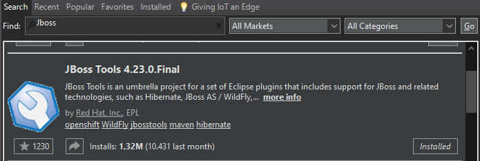

# Sistema de Gerenciamento de Biblioteca - Backend

Projeto de sistema da disciplina 4ADS que consiste no desenvolvimento
de um Sistema de Gerenciamento de Biblioteca. O sistema conta com
funcionalidades para gerenciar clientes, empréstimos, livros, funcionários e também
permite fazer a reserva online. 


## Tecnologias utilizadas

- Jakarta EE 8
- Hibernate 5.4
- Resteasy 3.12
- JWT (Json Web Token)


## Requisitos

- Eclipse IDE for Enterprise Java and Web Developers (release acima de 2021-09)
    - Plugin JBOSS Tools
- Apache Maven 3.6.3
- Wildfly 20
- Java 12 (mínimo)
- PostgreSQL 14

## Rodando Localmente

### Configurando Eclipse
1. Caso não tenha o Apache Maven instalado, siga este vídeo tutorial para instala-lo: https://www.youtube.com/watch?v=-ucX5w8Zm8s
2. Clone o projeto: 
```bash 
  git clone https://github.com/caducoder/java-biblioteca-api.git
``` 
3. Importe no Eclipse como Maven Project. Ele irá começar a baixar as dependências, aguarde.
4. Baixe o [Wildfly](https://www.wildfly.org/downloads/) 20.0.1.Final (Java EE Full & Web Distribution)
5. Instale o plugin JBOSS Tools. Help > Eclipse MarketPlace:
  
6. Adicione o Wildfly 20 ao Eclipse na aba Servers
7. Adicione o projeto ao Wildfly. Servers > botão direito no wildfly > Add And Remove > Seleciona biblioteca-api > Add > Finish.

> OBS: Caso dê algum erro no projeto, tente esses passos:
>> Project Explorer > botão direito no projeto > Maven > Update Project. 
>
>> Project Explorer > botão direito no projeto > Run As > Maven clean. Depois, Maven install 
>
>> Aba Project > Clean > Selecione o projeto > Clean.

### Configurando Banco de dados e Datasource no Wildfly

1. Crie um banco de dados chamado 'db_biblioteca' no PostgreSQL 14
2. Com o banco criado, abra o cmd na pasta bin do PostgreSQL
3. Rode o seguinte comando, alterando o caminho de acordo com seu ambiente, para o arquivo biblioteca.sql na pasta raiz do projeto:
```cmd
psql.exe -U postgres -d db_biblioteca -f C:\caminho\ate\o\arquivo\java-biblioteca-api\biblioteca.sql
```
4. Digite a senha (não aparece caracteres), enter. Pronto, seu banco está pronto para ser utilizado, pode fechar o cmd.
5. Inicie o servidor
6. Abra o terminal na pasta bin do Wildfly e rode o add-user.bat
7. Tipo de user (a) > Entre com as credenciais e guarde-as > Grupos deixe vazio (enter) > yes > no. Pode fechar o terminal.
8. Acesse localhost:8080 > Administration Console > digite as credenciais que vc guardou.
9. Após logar vá em Configuration > Subsystems > Datasources & Drivers > Datasources > Add Datasource.
10. Selecione PostgreSQL next> nome pode deixar o padrão next> Driver Name: selecione biblioteca-api-1.0.war_org.postgresql.Driver_42_3 next> Na url coloque a porta e o nome do banco de dados criado anteriormente. Usuário e senha do banco de dados next> Teste a conexão, se conectou, ok. next> Reinicie o servidor.
11. Acesse http://localhost:8080/biblioteca-api-1.0/ . Se aparecer "RESTEASY003210: Could not find resource for full path: http://localhost:8080/biblioteca-api-1.0/", Parabéns 🎉, o backend está configurado e pronto.

> Prossiga para https://github.com/caducoder/biblioteca-frontend e siga as instruções para subir o frontend.


## Autores

- [@caducoder](https://github.com/caducoder)
- [@Estefane794](https://github.com/Estefane794)

